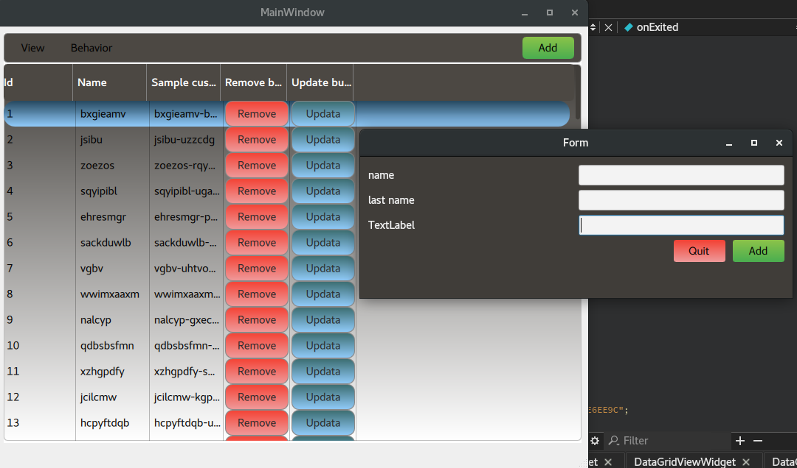

# GridView in widget 
***use in qml and c++ creat gridview for model  and  table***

##use link  gridview in qml
[link](https://github.com/HamedMasafi/qml-data-grid-view "link")

*custom file gridview  for widget*

